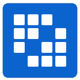

<!-- markdownlint-disable MD033 MD041 -->


<br/>

<h1> Hi,  I'm Daniel Gessese! </h1>

<br/>

<p align="center">
	
	
	
	
	
	
		
	
	
	
	 
</p>

I'm a self-taught passionate Database Adminstrator, FrontEnd/BackEnd developer from Ethiopia

<br />


## About me


### `Hello` I'm Daniel Gessese.


My username is @danielgessese:
```
Embrace your dreams, and, whatever happens protect your honor...as SOLDIER
```
---


## Biography

### :books: I'm currently learning

<code><a href="" target="_blank"></a></code>
<code><a href="" target="_blank"></a></code>
<code><a href="" target="_blank"></a></code>
<code><a href="" target="_blank"></a></code>
<code><a href="" target="_blank"></a></code>
<code><a href="" target="_blank"></a></code>

### :file_folder: Learned technologies 
<code><a href="" target="_blank"></a></code>
<code><a href="" target="_blank"></a></code>
<code><a href="" target="_blank"></a></code>
<code><a href="" target="_blank"></a></code>
<code><a href="" target="_blank"></a></code>
<code><a href="" target="_blank"></a></code>
<code><a href="" target="_blank"></a></code>
<code><a href="" target="_blank"></a></code>
<code><a href="" target="_blank"></a></code>


---

## Contact

### :computer: These are my networks and ways to contact me
<p align="center">
	<a href="https://github.com/Danigy"></a>
	<a href="https://www.linkedin.com/in/daniel-gessese-3b744543/" rel="nofollow"></a>
	<a href="https://twitter.com/danielgessese" rel="nofollow"></a>
	<a href="mailto:dnlmdwrk@gmail.com"></a>
  <a href="https://api.whatsapp.com/send?phone=251911190202&amp;text=Hello%2C%20I%20would%20like%20to%20talk%20about%20a%20new%20project." rel="nofollow"></a>
</p>

---
<p align="center">

</p>


<p align="center">

<a href="https://github.com/Danigy/Danigy/blob/master/LICENCE">
 
  </a>
  
   <a href="https://img.shields.io/github/stars/Danigy/Danigy?style=social">
  
 </a>

<a href="https://komarev.com/ghpvc/?username=Danigy&color=green">
  
 </a>
</p>


<p align="center">
  <h2 align="center">🚀I'm Software Engineer💥</h2> 
</p>


<p align="center">
  
</p>
 
>Learning bash, bash scripting ... and much more. Learning at ALX Africa is going to be icing on the cake!!. I ❤️ it ... 


### [](https://git.io/typing-svg)  
 
 <br />
  <code></code>
  <code></code>
  <code></code>
  <code></code>
  <code></code>
  <code></code>
  <code></code>
  <code></code>
  <code></code>
  <code></code>
  <code></code>

<br />

#### GitHub Stats 📝

<br />

| **Contributions** |  |
| --- | --- |
|  |  |


<details>
<summary> <b>📊 Some GitHub stats </b></summary>
	
<h3> 👨‍💻 Languages I use</h3>

<!--START_SECTION:colourise-->
<p align=center>


</p>
<!--END_SECTION:colourise-->
	
<p align="center">
<!--   
-->

</p>
</details>

<br/>
<p align="center">
<b> If you like my work, you can support me by buying me a coffee by clickings the link below </b>
<p>
<p align="center">
	<a href="https://www.buymeacoffee.com/dnlmd"> 
	<a href="https://www.patreon.com/user?u=84162601">  
	<a href="https://ko-fi.com/danigy"> <p/>
	
<br/>	
<p align="center">
	<a href="https://t.me/danielgessese"> <a/><p/>
	

	 
<br />
		


This project is licensed under [GNU General Public License](https://github.com/Danigy/blob/master/LICENSE).
